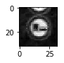
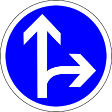
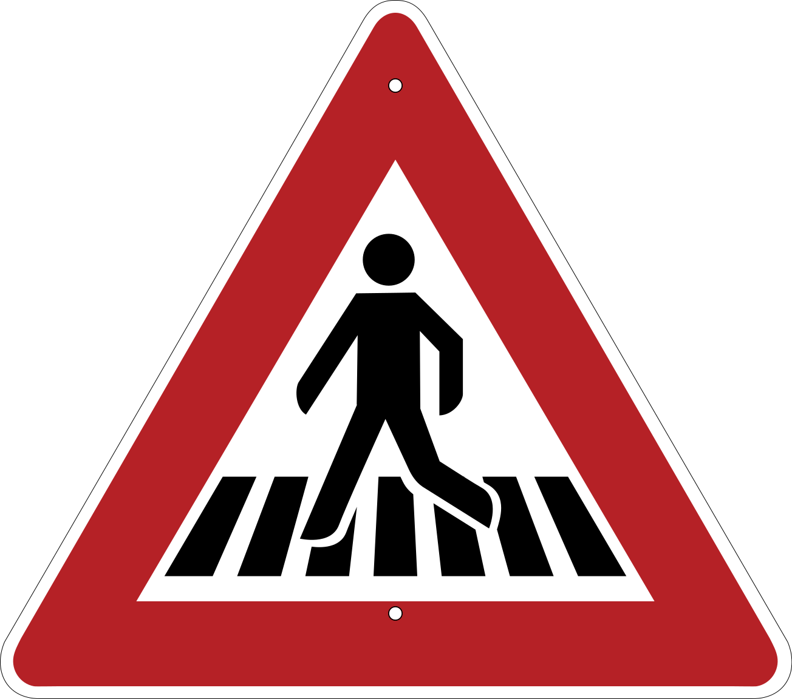
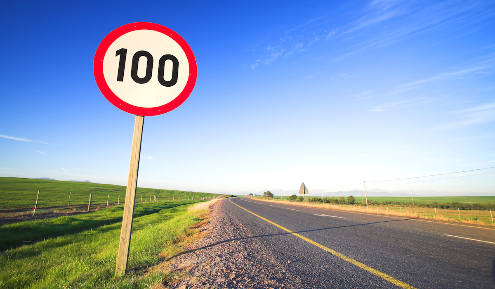

#**Traffic Sign Recognition** 

---

**Build a Traffic Sign Recognition Project**

The goals / steps of this project are the following:
* Load the data set (see below for links to the project data set)
* Explore, summarize and visualize the data set
* Design, train and test a model architecture
* Use the model to make predictions on new images
* Analyze the softmax probabilities of the new images
* Summarize the results with a written report

## Rubric Points
###Here I will consider the [rubric points](https://review.udacity.com/#!/rubrics/481/view) individually and describe how I addressed each point in my implementation.  

---
### Writeup / README

#### Each rubric point is described in following:

You're reading it! and here is a link to my [project code](https://github.com/aimllifetime/traffic_sign_classifier/blob/master/Traffic_Sign_Classifier.ipynb)

### Data Set Summary & Exploration

#### 1. the data set is read into program using pickle.load library for _X_train, X_valid and X_test_. Then the each pickle data is used to extract the images and theirs labels for example: X_train, y_train

Use python array "len" fuction on X_train and other variables, we have following summary information of data set.

* The size of training set is = len(X_train) = 34799
* The size of the validation set is = len(X_valid) = 4410
* The size of test set is = len(X_test) = 4410
* The shape of a traffic sign image is = X_train[0].shape = (32, 32, 3)
* The number of unique classes/labels in the data set is = 43   <= this is read from signnames.csv on how many of entries of records.

#### 2. Include an exploratory visualization of the dataset.

Used "Pandas" library to plot the distribution of each class' count. 

![Distribution of Sample Count per Class] (./result_images/distributiion_of_each_class.png)

Note the class 27 has very small training examples, i.e. only has 210 training examples

About half of the classes has less than 500 training example. it might be good idea to do data augmentation to create more training images.

Then, randomly pick one image index 33801 out of training example and plot it to see visually.

### Design and Test a Model Architecture

#### 1. Preprocessing images: two techniques are applied for pre-processing image such as grayscale and normalize image

_pre_process_batch_image_ function takes an array of images as input such as _X_train_. It loops through each image with _grayscale_ and _normalize_grayscale_. 

_grayscale_ returns an image using cv library: cv2.cvtColor(image, cv2.COLOR_RGB2GRAY)

_normalize_grayscale_ returns image using: _a + ( ( (image_data - grayscale_min)*(b - a) )/( grayscale_max - grayscale_min ) )_ where a = 0.1 and b = 0.9

It is necessary to reshape of normalized image to(32, 32, 1) from (32, 32). Later LeNet assumes input channel parameter.

Converting the images to grayscale helps in couple of ways:
* color does not really make difference in term of classification
* reduce color to gray can also save 2/3 of computation

Normalizing the image data has benefits as follows:
* have data of mean equal to zero and equal variance.
* Search algorithm spends much less time to find optimal solution, such as in gradient decent search process.

#### 2. Following table described the modified LeNet CNN for traffic sign classification:

My final model consisted of the following layers:

| Layer         		|     Description	        					| 
|:---------------------:|:---------------------------------------------:| 
| Input         		| 32x32x1 Gray image   							| 
| Convolution 5x5     	| 1x1 stride, valid padding, outputs 28x28x6 	|
| RELU					|												|
| dropout  | probability = 0.7 |
| Max pooling	      	| 2x2 kernel, 2x2 stride,  outputs 14x14x6 				|
| Convolution 5x5	    | 1x1 stride, valid padding outputs 10x10x16      									|
| RELU					|												|
| dropout  | probability = 0.7 |
| Max pooling	      	| 2x2 kernel, 2x2 stride,  outputs 5x5x16			|
| flatten | output 400 |
| Fully Connected | input 400, output 120 | 
| RELU					|												|
| dropout  | probability = 0.7 |
| Fully Connected | input 120, output 84 | 
| RELU					|												|
| dropout  | probability = 0.7 |
| Fully Connected | input 84, output 43 | 
| dropout  | probability = 0.7 |

 
#### 3. The training model uses following techniques and parameter:

* use LeNet as the CNN to do the calssifier. 
* use cross entrophy to calcuate the loss.
* use the Adam optimizer to do the gradient decent.
* Batch size was set to 128 which to be found optimal one from previous quiz learning. 
* learning rate is kept at 0.001 which is also learned from previous quiz work. 
* Epoch is set to 20 initially but increased to 50. More epoch increase the accuracy of model
* weight variable is set to mean = 0 and variance = 0.1
* dropout = 0.7

#### 4. following describe approaches taken for finding a solution and getting the validation set accuracy to be at least 0.93.

after using early stop in EPOCH iteration, My final model results were :
* training set accuracy of 0.954
* validation set accuracy of 0.954
* test set accuracy of 0.9535

If an iterative approach was chosen:
* What was the first architecture that was tried and why was it chosen?
LeNet with 3 channel was tried out first without dropout, image grayscale and normalization. The accuracy is about close to 0.9 only
* What were some problems with the initial architecture?
it seems overfit the training. 
* How was the architecture adjusted and why was it adjusted? 
the dropout was added to each layer of original LeNet with probability of 0.7
* Which parameters were tuned? How were they adjusted and why?
dropout tried 0.5 and 0.8 etc. found 0.7 is best value to reach over 0.93
add epoch from 20 to 50 to have more training

* What are some of the important design choices and why were they chosen? For example, why might a convolution layer work well with this problem? How might a dropout layer help with creating a successful model?
LeNet is well know CNN to classify the 10 digit. Use the convenet is direct thought. However, it does not give best result without modification

If a well known architecture was chosen:
* What architecture was chosen? Googlenet
* Why did you believe it would be relevant to the traffic sign application?
from the site: http://cs231n.github.io/convolutional-networks/ it extends the AlexNet with deeper and bigger CNN layer. It also reduced the parameter computation dramatically by introduced the **_Inception Module_** idea. it consumes much less parameter i.e. 4M, compared to AlexNet with 60M

* How does the final model's accuracy on the training, validation and test set provide evidence that the model is working well?
 the accuracy on training, validationa nd test set are very close to each other.

### Test a Model on New Images

#### 1. Choose five German traffic signs found on the web and provide them in the report. For each image, discuss what quality or qualities might be difficult to classify.

Here are five German traffic signs that I found on the web:

 
 

#### 2. Discuss the model's predictions on these new traffic signs and compare the results to predicting on the test set. 

Here are the results of the prediction:

| Image			        |     Prediction	  (training accuracy 0.93)      					|     Prediction	  (training accuracy 0.954)         |
|:---------------------:|:---------------------------------------------:|:------------------------------------------- :|
| Do-Not-Enter      		|   17,No entry									| 17,No entry	|
| pedestrain	      		| 11,Right-of-way at the next intersection					 				|   27,Pedestrians |
| speed limit 100		| 11,Right-of-way at the next intersection     							| 8,Speed limit (120km/h) |
| go straight or right					| 	14,Stop										| 36,Go straight or right |
| bicycle cross right of road | 11,Right-of-way at the next intersection |11,Right-of-way at the next intersection	|

When the model accuracy is of 0.93, it was able to correctly guess only 1 of the 5 traffic signs, which gives an accuracy of 20%. This seems low compared to the test accuracy.

when the model accuracy is of 0.954, it correctly classified 3 out of 5 web image and increased accuracy to 60%

#### 3. Describe how certain the model is when predicting on each of the five new images by looking at the softmax probabilities for each prediction. Provide the top 5 softmax probabilities for each image along with the sign type of each probability. 

The code for making predictions on my final model is located in the 20th cell of the Ipython notebook.

For the first image, the model is relatively sure that this is a no entry sign (probability of 1.0), and the image does contain a no entry sign. The top five soft max probabilities were

| Probability         	|     Prediction	        					| 
|:---------------------:|:---------------------------------------------:| 
| 1.00000000e+00        			| 17, No entry   									| 
| 7.89568324e-12   				| 14, stop										|
| 2.66821244e-12					| 39, keep left										|
| 2.12974451e-12	      			|0,Speed limit (20km/h)				 				|
| 5.05295512e-13			    | 6,Go straight or right     							|

For the second image ... 

| Probability         	|     Prediction	        					| 
|:---------------------:|:---------------------------------------------:| 
| 9.05359149e-01        			| 11,Right-of-way at the next intersection 									| 
| 8.96053016e-02   				| 27,Pedestrians									|
| 5.02633490e-03					| 18,General caution									|
| 7.05399316e-06	      			|30,Beware of ice/snow				 				|
| 1.32864966e-06			    | 40,Roundabout mandatory    							|

for the third image

| Probability         	|     Prediction	        					| 
|:---------------------:|:---------------------------------------------:| 
| 2.71772653e-01        			|  14, stop	 									| 
| 2.48090386e-01   				| 	4,Speed limit (70km/h)								|
| 2.07091823e-01					| 1,Speed limit (30km/h)						|
| 1.69023097e-01	      			|2,Speed limit (50km/h)			 				|
| 3.13728116e-02			    | 38,Keep right    							|

       
for the fourth image

| Probability         	|     Prediction	        					| 
|:---------------------:|:---------------------------------------------:| 
| 4.55230981e-01        			| 11,Right-of-way at the next intersection  									| 
| 1.30545080e-01   				| 36,Go straight or right								|
| 1.30329639e-01					| 18,General caution								|
| 6.88620359e-02	      			|		40,Roundabout mandatory		 				|
| 3.61995883e-02			    | 32,End of all speed and passing limits     							|

for the fifth image

| Probability         	|     Prediction	        					| 
|:---------------------:|:---------------------------------------------:| 
| 9.99936581e-01        			| 11,Right-of-way at the next intersection   									| 
| 3.26904410e-05   				| 				18,General caution						|
| 1.62894885e-05					| 30,Beware of ice/snow										|
| 1.05564541e-05	      			|27,Pedestrians			 				|
| 1.88294962e-06			    | 28,Children crossing    							|

